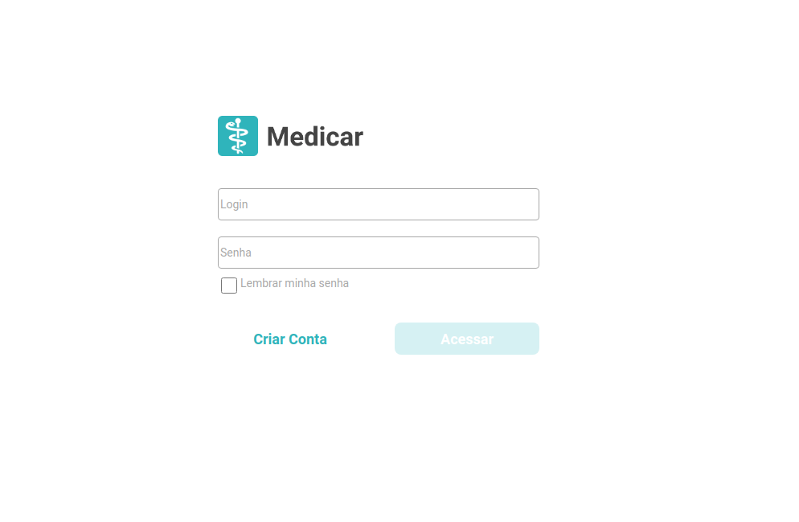
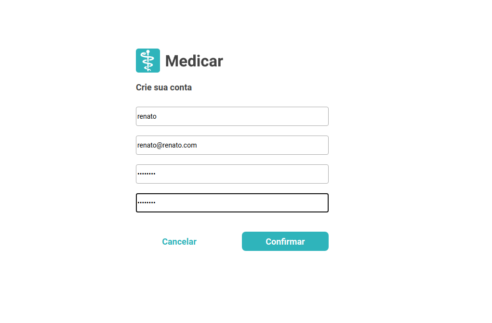
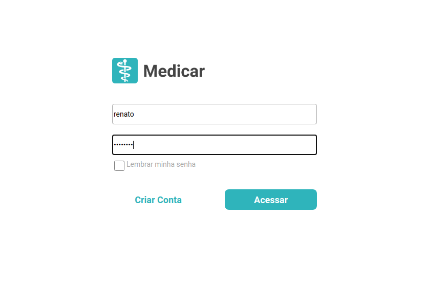
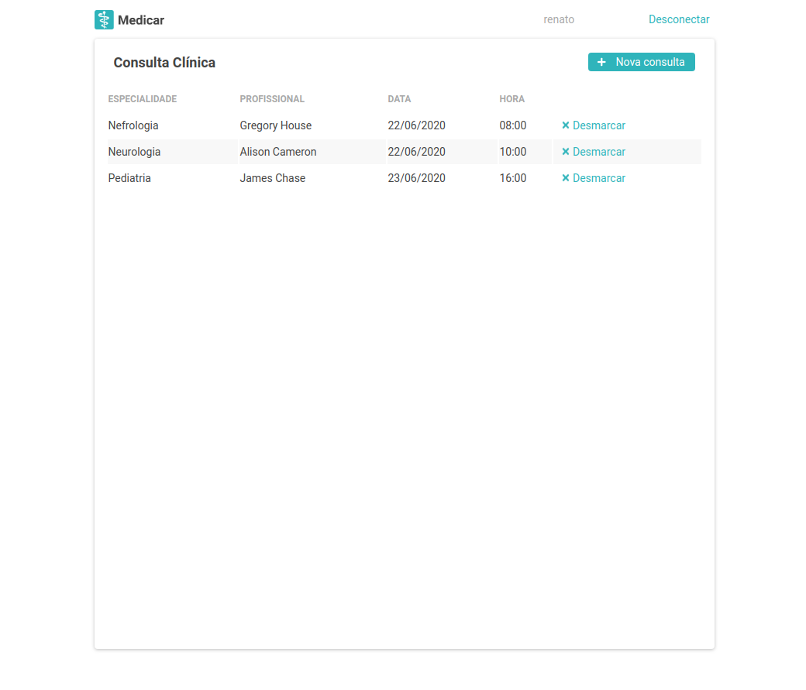
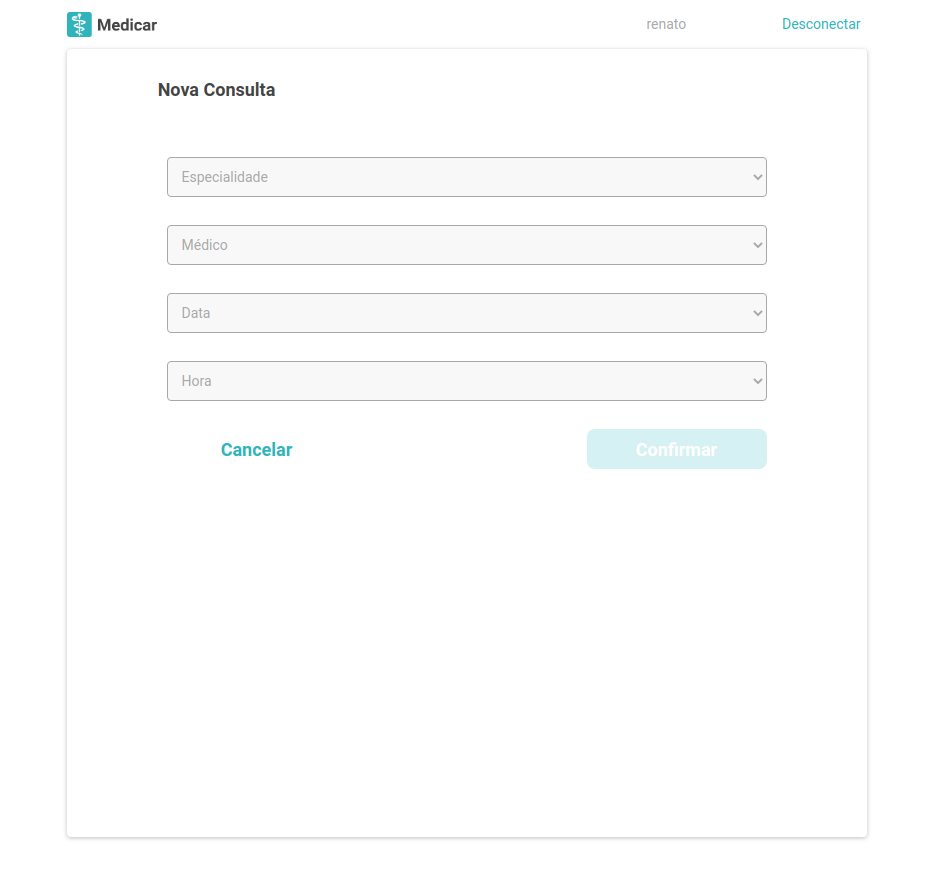
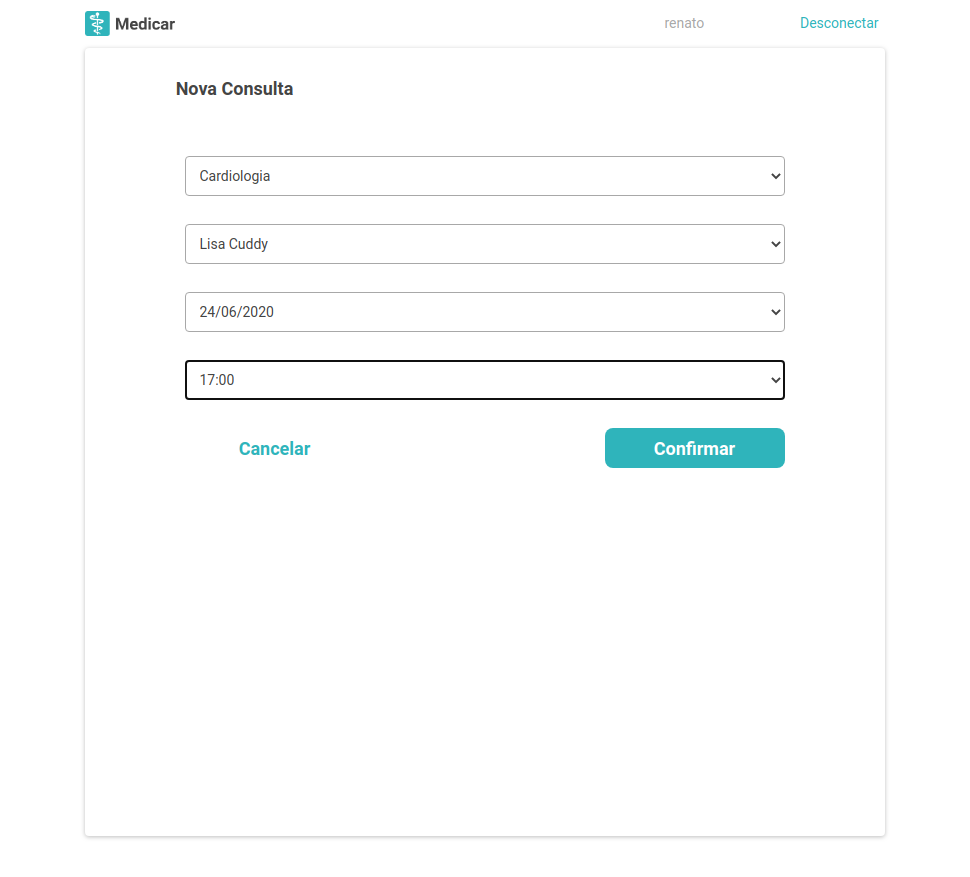

# Medicar
Um sistema para uma clínica chamada Medicar com o intuito de auxiliar seus 
clientes na marcação de consultas e gerenciar seu corpo médico.

## Primeiros passos
Faça o clone do repositório e acesse o backend:
```
git clone https://github.com/renatosouza/medicar.git
cd medicar/backend
```
<br>

## Acesso ao backend
Crie um ambiente virtual (usando python>=3.7) e instale as dependências:
```
$ python -m venv venv
$ source venv/bin/activate
(venv)$ pip install -r requirements.txt
```

Depois da instalação das dependências:
```
(venv)$ python manage.py migrate
```

### Testes
Para executar os testes:
```
(venv)$ python manage.py test api/tests
```

<br>

### Instruções de uso

#### Crie um usuário administrador
Para criar o usuário administrador, aquele que pode acessar a interface administrativa, dê o comando a seguir e digite os dados pedidos:
```
(venv)$ python manage.py createsuperuser
```

#### Rode a aplicação
Para executar o servidor:
```
(venv)$ python manage.py runserver
```

#### Acesse a interface administrativa
A interface administrativa pode ser acessada através da url http://localhost:8000/admin/. Ela contém as funcionalidades a seguir:


##### Cadastrar especialidades
É possível cadastrar as especialidades médicas (ex: CARDIOLOGIA, PEDIATRIA) que a clínica atende fornecendo as seguintes informações:

* **Nome:** nome da especialidade médica (obrigatório)


##### Cadastrar médicos
É possível cadastrar os médicos que podem atender na clínica fornecendo as seguintes informações:

* **Nome:** Nome do médico (obrigatório)
* **CRM:** Número do médico no conselho regional de medicina (obrigatório)
* **E-mail:** Endereço de e-mail do médico
* **Telefone:** Telefone do médico
* **Especialidade:** Especialidade na qual o médico atende


##### Criar agenda para médico
É possível criar uma agenda para um médico em um dia específico fornecendo as seguintes informações:

* **Médico:** Médico que será alocado (obrigatório)
* **Dia:** Data de alocação do médico (obrigatório)
* **Horários:** Lista de horários na qual o médico deverá ser alocado para o dia especificado (obrigatório)

#### API
Para instruções específicas de como usar a API, acesse o [link](backend/README.md).

<br>

## Acesso ao frontend
Com o servidor do backend executando, abra outra aba no terminal e acesse a pasta frontend:
```
cd ../frontend
```

Instale as dependências e execute a aplicação:
```
npm install
npm start
```

<br>

### Instruções de uso
A aplicação pode ser acessada a partir da url http://localhost:4200.
A primeira página a ser aberta é a tela de login:



Clique em Criar Conta para acessar a tela de registro. Nela preencha seus dados:



Ao clicar em confirmar o usuário é logado automaticamente. 
Se o usuário já cadastrado acessar a tela de login, basta ele colocar seu nome de usuário (não email) e sua senha:



Então é exibida uma tela com as consultas já cadastradas do usuário:



Clique em Nova Consulta para marcar uma nova consulta:



Preencha os dados da consulta:



Clique em confirmar. Você será direcionado para a página inicial e sua consulta estará listada lá.